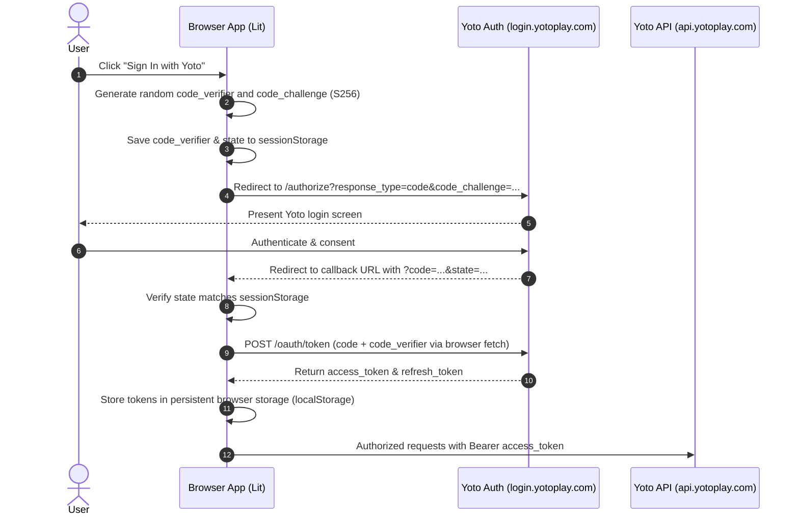
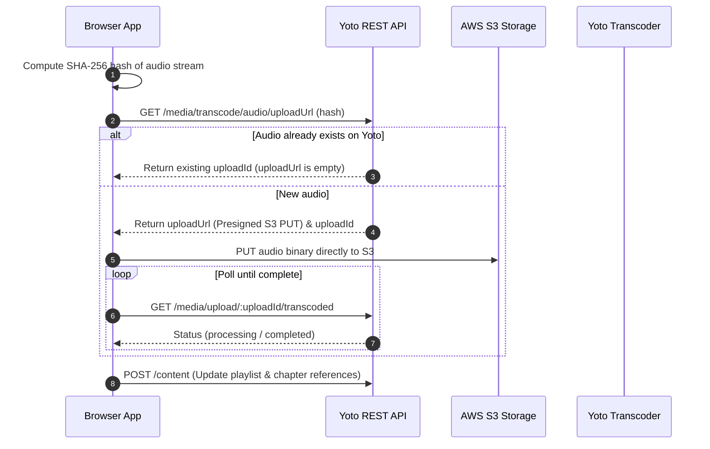

# Architecture & System Design (`yoto-tools`)

This document details the high-level architecture of `yoto-tools`. To keep documentation accurate, granular implementation details are maintained in the codebase comments and type definitions, while this document focuses on architectural topology, security boundaries, hosting/staging patterns, and data flow patterns.

---

## 1. System Topology Overview

`yoto-tools` is an entirely client-side Single-Page Application (SPA) built with [Lit](https://lit.dev/) and hosted statically on **Netlify**. It communicates directly with Yoto cloud APIs and device brokers:

```mermaid
flowchart TD
    subgraph Browser["User's Browser (yoto-tools SPA)"]
        Router["@lit-labs/router (Client Routing)"]
        UI["Lit Components & Widgets (/src/widgets)"]
        State["App State & Storage (localStorage & IndexedDB)"]
        AuthModule["OAuth2 PKCE Service"]
        YotoAPIClient["Yoto REST API Client (fetch)"]
        MQTTService["MQTT over WebSocket (mqtt.js)"]
        AudioProcessor["Audio & Hash Engine (Web Crypto)"]
        IconEngine["Client Search Evaluator (Inverted Index)"]
    end

    subgraph Hosting["Netlify Static Edge CDN"]
        StaticAssets["HTML / JS / CSS / Fonts"]
        IconDB["Pre-indexed icons.[hash].json & PNG assets"]
        HeadersConfig["netlify.toml (Immutable Asset Caching)"]
        ProxyRule["Edge Proxy Rewrites (RSS CORS Relay)"]
    end

    subgraph YotoCloud["Yoto Cloud Services"]
        YotoAuth["Auth0 Identity (login.yotoplay.com)"]
        YotoREST["REST API (api.yotoplay.com)"]
        YotoS3["Direct Audio Upload (AWS S3)"]
        YotoMQTT["AWS IoT Core (aqrphjqbp3u2z-ats.iot.eu-west-2.amazonaws.com)"]
    end

    subgraph External["External Services"]
        Podcasts["Podcast Media Hosts (Direct MP3)"]
        ExternalFeeds["Podcast RSS XML Providers"]
    end

    %% Routing & Components
    Router --> UI
    UI --> State
    UI --> AuthModule
    UI --> YotoAPIClient
    UI --> MQTTService
    UI --> AudioProcessor
    UI --> IconEngine

    %% Network interactions
    Browser -->|Static bundle & cached icons| StaticAssets
    IconEngine -->|Load once on demand| IconDB
    AuthModule <-->|OAuth2 PKCE / Token Exchange| YotoAuth
    YotoAPIClient <-->|Cards, Metadata, Playlists| YotoREST
    AudioProcessor -->|Direct PUT Presigned URL| YotoS3
    MQTTService <-->|WSS bidirectional control & status| YotoMQTT
    AudioProcessor -->|Fetch episode audio (CORS enabled)| Podcasts
    YotoAPIClient -->|Fetch XML via proxy rewrite| ProxyRule
    ProxyRule -->|Forward request| ExternalFeeds
```

---

## 2. Hosting, Staging, & Deployment Pipeline

### Platform: Netlify
The project uses Netlify for static asset delivery as detailed in [RFC: Hosting Platform & Staging Strategy](rfcs/2026-09-17-hosting-and-staging-strategy.md):
- **Framework-Agnostic Static Pipeline:** Built with Vite and published as static assets.
- **Automated PR Deploy Previews:** Every pull request automatically generates an isolated, ephemeral preview environment (e.g. `https://deploy-preview-12--yoto-tools.netlify.app`), allowing team members to test features before merging.
- **Zero-Risk Billing:** Free tier includes hard-stop policies preventing unexpected overage charges.
- **Custom Headers (`netlify.toml`):** Fingerprinted assets in `/assets/*` are marked immutable with 1-year cache headers (`Cache-Control: public, max-age=31536000, immutable`), while the HTML entrypoint is set to `Cache-Control: public, max-age=0, must-revalidate`.

### Automated End-to-End Verification (Playwright)
- Automated Playwright suites run against pull request deploy preview URLs and production deployments in CI.
- Verification uses a dedicated, isolated non-production Yoto account to validate authentication, playlist operations, and icon selection without impacting personal hardware.

---

## 3. Client Architecture & SPA Routing

The frontend is structured as a Single-Page Application using **`@lit-labs/router`** as detailed in [RFC: Client-Side SPA & Routing Strategy](rfcs/2026-09-17-client-spa-and-routing-strategy.md):
- **Why SPA over MPA:**
  - Maintains persistent WebSocket connections to Yoto's AWS IoT MQTT broker for live player updates.
  - Allows background audio processing and uploads to proceed uninterrupted while navigating the UI.
  - Keeps pre-indexed icon catalogs and search indices loaded in memory.
- **Reusable Widget System (`src/widgets/`):** All interactive primitives (buttons, inputs, modal dialogs, status badges) are standardized custom elements to maintain UI consistency across routes.

---

## 4. Authentication & Security Flow (OAuth 2.0 PKCE)

The application acts as an OAuth 2.0 **Public Client** registered with the Yoto Developer Portal.



---

## 5. Audio Ingestion & Podcast Sync Architecture

Detailed in [RFC: Podcast RSS Importer & Card Sync](rfcs/2026-09-17-podcast-rss-importer-and-card-sync.md):

1. **Audio File Processing:** Audio files from folder drag-and-drop or direct podcast MP3 downloads are buffered as `ArrayBuffer` / `Blob` instances.
2. **SHA-256 Hashing:** Browser computes `crypto.subtle.digest('SHA-256', buffer)` to obtain the base64url content hash.
3. **Deduplication Check:** The client calls `GET /media/transcode/audio/uploadUrl?sha256=...`. If the audio already exists on Yoto servers, the upload is skipped entirely.
4. **Direct-to-S3 Upload:** New audio is streamed directly to the presigned AWS S3 upload URL via `PUT`.
5. **Transcode Polling:** The app polls `GET /media/upload/:uploadId/transcoded` until Yoto's transcode pipeline finishes.
6. **Card Metadata Sync:** The card playlist definition (`/content`) is updated with new chapter and track structures.



---

## 6. Real-Time Player Connection (AWS IoT WebSockets)

Device telemetry and control utilize native browser WebSockets connected directly to AWS IoT Core:
- **Transport:** WebSocket over TLS (`wss://`)
- **Protocol:** MQTT 3.1.1
- **Authentication:** Custom authorizer (`?x-amz-customauthorizer-name=PublicJWTAuthorizer`) passing the JWT access token in the MQTT password.
- **Topics:**
  - `device/{deviceId}/data/status`: Battery, online state, ambient light status.
  - `device/{deviceId}/data/events`: Card insertion, playback state transitions.
  - `device/{deviceId}/command`: Remote control (play, pause, volume adjustment).

---

## 7. Multi-Provider Icon Ecosystem & Search Engine

Icon management uses a unified inverted indexing architecture detailed in:
- [RFC: Inverted Icon Indexing & Client-Side Search Engine](rfcs/2026-09-17-inverted-icon-index-and-search.md)
- [RFC: Google Noto Emoji Icon Provider Integration](rfcs/2026-09-17-noto-emoji-icon-provider.md)
- [RFC: Official Yoto Icon Provider Integration](rfcs/2026-09-17-yoto-official-icon-provider.md)
- [RFC: Community Icon Provider Integration (yotoicons.com)](rfcs/2026-09-17-yotoicons-community-integration.md)

**Core Principles:**
- Build-time generation builds a consolidated `icons.[hash].json` mapping keywords/stems to integer array offsets.
- Provides sub-millisecond query latency and offline capability.
- Fingerprinted 16×16 PNG assets served with immutable cache headers.
