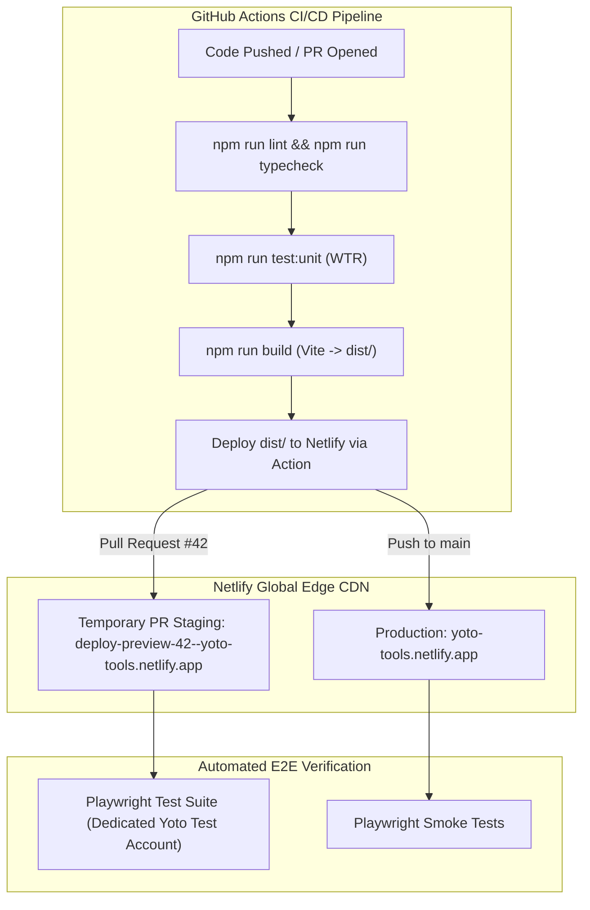

# RFC 001: Hosting Platform, CI/CD Pipeline, & Ephemeral PR Staging Strategy

- **Date:** 2026-09-17
- **Status:** Accepted
- **Author:** Antigravity Agent & Andrew Nitschke

---

## 1. Summary

This proposal establishes the continuous integration, build, preview/staging, and static hosting pipeline for `yoto-tools`. Rather than having Netlify execute build commands, all compilation, linting, unit testing, and static asset generation are performed within **GitHub Actions**. GitHub Actions then deploys pre-built `dist/` artifacts to **Netlify**, automatically provisioning an **isolated, temporary preview environment for every Pull Request**, followed immediately by automated Playwright end-to-end testing against the live preview URL.

---

## 2. Platform Architecture: GitHub Actions Build + Netlify Edge CDN



### Key Advantages:
1. **Isolated Temporary PR Staging per PR:**
   - Every Pull Request automatically receives its own isolated URL (e.g. `https://deploy-preview-42--yoto-tools.netlify.app`).
   - The GitHub Action posts a comment on the PR containing the live preview URL.
   - Pushing new commits updates the staging environment in-place. Closing or merging the PR automatically archives it.
2. **Unified CI/CD Pipeline:** Linting, type-checking, component tests, building, staging deployment, and post-deploy E2E testing execute sequentially within a single GitHub Actions workflow run.
3. **Preserves Free-Tier Build Minutes:** GitHub Actions provides 2,000 free minutes/month (and unlimited minutes for public open-source repos). Building on GitHub avoids consuming Netlify's restricted 300 build minutes/month.
4. **Immediate E2E Verification Target:** Because GitHub Actions deploys the preview and receives its live URL, it can immediately launch Playwright tests against that exact temporary staging environment in the very next step.
5. **Zero-Risk Billing:** Netlify acts strictly as a static edge CDN with hard-stop limits that prevent unexpected overage charges.
6. **Dynamic OAuth PR Previews:** As defined in [RFC 007: OAuth Client Registration & Ephemeral PR Preview Redirect Strategy](007-oauth-client-id-and-pr-preview-redirects.md), temporary staging environments participate in OAuth logins via forwarding from the canonical production domain.
7. **Security Gate & Malicious PR Protection (Maintainer Approval Required):**
   - Public PRs from external forks pose a security risk if allowed to build and deploy staging sites automatically. A malicious contributor could submit a PR with phishing UI or malicious scripts that get published under the trusted `*.netlify.app` domain and access staging credentials/test accounts.
   - To eliminate this attack vector, the staging deployment job targets a protected GitHub Actions Environment (`staging-preview`) requiring **explicit maintainer manual approval** before building or deploying. Furthermore, GitHub's default repository setting "Require approval for all outside contributors" must be enforced.

---

## 3. GitHub Actions Workflow Specification (`.github/workflows/ci-cd.yml`)

```yaml
name: CI/CD & Deploy

on:
  push:
    branches: [main]
  pull_request:
    branches: [main]

jobs:
  # Unit testing & linting runs on PRs without needing production secrets
  validate:
    runs-on: ubuntu-latest
    steps:
      - name: Checkout repository
        uses: actions/checkout@v4

      - name: Setup Node.js
        uses: actions/setup-node@v4
        with:
          node-version: 22
          cache: 'npm'

      - name: Install dependencies
        run: npm ci

      - name: Code Quality & Type Check
        run: |
          npm run lint
          npm run typecheck

      - name: Run Component Unit Tests
        run: npm run test:unit

  # Deploy to preview/staging or production.
  # For PRs, this job is gated behind a GitHub Environment ('staging-preview')
  # requiring explicit manual review and approval by the maintainer.
  build-and-deploy:
    needs: [validate]
    runs-on: ubuntu-latest
    environment:
      name: ${{ github.event_name == 'pull_request' && 'staging-preview' || 'production' }}
      url: ${{ steps.netlify-deploy.outputs.deploy-url }}
    steps:
      - name: Checkout repository
        uses: actions/checkout@v4

      - name: Setup Node.js
        uses: actions/setup-node@v4
        with:
          node-version: 22
          cache: 'npm'

      - name: Install dependencies
        run: npm ci

      - name: Build Static Production Assets
        run: npm run build

      # Automatically deploys to production on 'main', or generates an isolated
      # temporary preview URL for Pull Requests (deploy-preview-<PR_NUM>--<SITE>.netlify.app)
      - name: Deploy to Netlify
        id: netlify-deploy
        uses: nwtgck/actions-netlify@v3
        with:
          publish-dir: './dist'
          production-branch: main
          alias: ${{ github.event_name == 'pull_request' && format('deploy-preview-{0}', github.event.number) || '' }}
          github-token: ${{ secrets.GITHUB_TOKEN }}
          deploy-message: "Deploy from GitHub Actions #${{ github.run_number }}"
          enable-pull-request-comment: true
          enable-commit-comment: false
        env:
          NETLIFY_AUTH_TOKEN: ${{ secrets.NETLIFY_AUTH_TOKEN }}
          NETLIFY_SITE_ID: ${{ secrets.NETLIFY_SITE_ID }}

      - name: Install Playwright Browsers
        run: npx playwright install --with-deps chromium

      # Run automated E2E tests against the deployed staging preview (or prod)
      - name: Run E2E Tests Against Deployed Preview
        env:
          TARGET_URL: ${{ steps.netlify-deploy.outputs.deploy-url }}
          YOTO_TEST_ACCOUNT_EMAIL: ${{ secrets.YOTO_TEST_ACCOUNT_EMAIL }}
          YOTO_TEST_ACCOUNT_PASSWORD: ${{ secrets.YOTO_TEST_ACCOUNT_PASSWORD }}
        run: npm run test:e2e
```

---

## 4. Netlify Hosting Directive (`netlify.toml`)

Because GitHub Actions handles the build execution, `netlify.toml` omits the `command` directive and only specifies the publish directory:

```toml
# ==============================================================================
# Publishing Settings
# See: docs/rfcs/001-hosting-and-staging-strategy.md
# ==============================================================================
[build]
  publish = "dist"
```
*(Routing fallbacks are defined in [RFC 003](003-client-spa-and-routing-strategy.md) and HTTP caching in [RFC 004](004-asset-bundling-and-cache-busting.md); external RSS CORS relay is handled via [corsproxy.io](https://corsproxy.io/) per [RFC 009](009-cors-proxy-for-rss-feeds.md)).*
