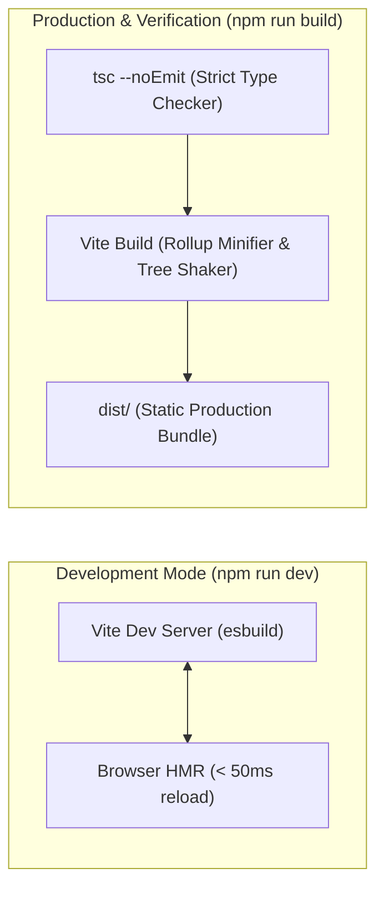

# RFC: Build Tooling, Bundling, and TypeScript Compilation Pipeline

- **Date:** 2026-09-17
- **Status:** Accepted
- **Author:** Antigravity Agent & Andrew Nitschke

---

## 1. Summary

This proposal formalizes the development and production build pipeline for `yoto-tools`. It defines the compiler configuration, Vite integration, TypeScript strictness settings, decorator support for Lit 3.x, and the separation between development HMR and production type-checking.

---

## 2. Compiler & Bundler Architecture

The build pipeline adopts **Vite** paired with standard **TypeScript (`tsc`)**:



### Key Decisions:
1. **Instant Dev HMR with esbuild:** Vite uses `esbuild` for lightning-fast module transformation during local development, providing instantaneous page updates without full rebuilds.
2. **Deterministic Type-Checking:** Because `esbuild` strips types without checking them, production builds and CI pipelines run `tsc --noEmit` to guarantee full type safety before emitting code.
3. **Rollup for Production Optimization:** Vite bundles production output via Rollup, generating fingerprinted, tree-shaken single JS and font bundles as specified in the Asset Bundling RFC.

---

## 3. TypeScript Configuration (`tsconfig.json`)

The configuration enforces strict type safety and enables the experimental decorators required by Lit:

```json
{
  "compilerOptions": {
    "target": "ES2022",
    "module": "ESNext",
    "moduleResolution": "bundler",
    "lib": ["ES2022", "DOM", "DOM.Iterable"],
    
    /* Strict Type-Checking Rules */
    "strict": true,
    "noImplicitAny": true,
    "strictNullChecks": true,
    "strictFunctionTypes": true,
    "noImplicitThis": true,
    "alwaysStrict": true,
    "noUnusedLocals": true,
    "noUnusedParameters": true,
    "noImplicitReturns": true,
    "noFallthroughCasesInSwitch": true,
    "noUncheckedIndexedAccess": true,

    /* Lit Component Decorator Support */
    "experimentalDecorators": true,
    "useDefineForClassFields": false,

    /* Output & Bundler Settings */
    "isolatedModules": true,
    "skipLibCheck": true,
    "noEmit": true
  },
  "include": ["src/**/*.ts", "test/**/*.ts"],
  "exclude": ["node_modules", "dist"]
}
```

---

## 4. Standard Scripts (`package.json`)

```json
{
  "scripts": {
    "dev": "vite",
    "build": "tsc --noEmit && vite build",
    "preview": "vite preview",
    "typecheck": "tsc --noEmit",
    "lint": "eslint 'src/**/*.ts' 'test/**/*.ts'",
    "format": "prettier --write 'src/**/*.{ts,css,html}'",
    "test:unit": "wtr",
    "test:e2e": "playwright test"
  }
}
```
