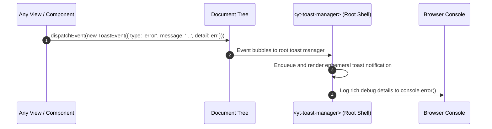

# RFC: Error Handling, Console Diagnostics, and Toast Notifications

- **Date:** 2026-09-17
- **Status:** Accepted
- **Author:** Antigravity Agent & Andrew Nitschke

---

## 1. Summary

This proposal establishes the unified error handling, diagnostic logging, and user notification architecture for `yoto-tools`. It defines a decoupled DOM event-driven toast system (`<yt-toast-manager>`), structured console diagnostics, and automatic silent token refresh handling.

---

## 2. Event-Driven Toast Notification System

Rather than coupling views to a centralized modal service, any component or service in the application can dispatch a standard DOM bubbling event to trigger user-facing notifications:



### A. The `ToastEvent` Structure (`src/widgets/events.ts`)
```typescript
export interface ToastOptions {
  message: string;
  type?: 'info' | 'success' | 'warning' | 'error';
  durationMs?: number; // default: 4000ms (0 for persistent error toasts)
  actionLabel?: string;
  onAction?: () => void;
  errorDetail?: unknown;
}

export class ToastNotificationEvent extends CustomEvent<ToastOptions> {
  static readonly EVENT_NAME = 'yt-toast';
  constructor(options: ToastOptions) {
    super(ToastNotificationEvent.EVENT_NAME, {
      bubbles: true,
      composed: true, // crosses Shadow DOM boundaries
      detail: options,
    });
  }
}
```

### B. Toast Manager (`<yt-toast-manager>`)
Placed at the top-level application shell (`<yt-app>`):
- Listens for `yt-toast` events bubbling up from anywhere in the component hierarchy.
- Manages an interactive toast queue with stack animations, accessible ARIA live regions (`aria-live="polite"` or `assertive`), auto-dismiss timers, and action buttons (e.g. "Retry", "Use Fallback").

---

## 3. Console Diagnostic Logging Policy

To mirror the clean UNIX philosophy of `yotocli` while providing rich developer diagnostics:
1. **User Surface (Toasts):** Keep user-facing toast messages concise, friendly, and actionable (e.g. *"Could not fetch podcast feed. Try pasting the XML directly."*).
2. **Developer Surface (Console):** Whenever an error toast is triggered, the toast manager or originating service logs full diagnostic context via `console.error(...)` or `console.warn(...)`:
   - HTTP status codes and response bodies.
   - Stack traces and request URLs.
   - This ensures power users and developers opening DevTools have complete diagnostic information without cluttering the UI.

---

## 4. Silent Token Refresh on HTTP 401

When calling Yoto REST APIs:
- If a request receives `HTTP 401 Unauthorized`:
  1. The API client halts pending requests and executes a single refresh call (`POST /oauth/token` with `grant_type: "refresh_token"`).
  2. If the refresh succeeds, the access token is updated in `localStorage` and the failed request is re-tried once transparently.
  3. If the refresh fails (e.g. refresh token revoked or expired), a warning toast is dispatched: *"Your session has expired. Please sign in again."*, redirecting the user to the login screen.
