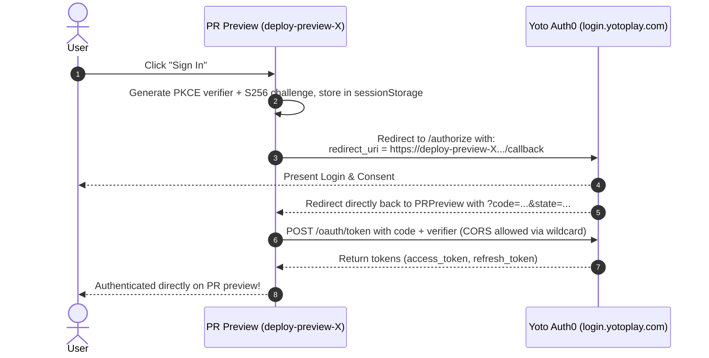

# RFC: OAuth Client Registration & Ephemeral PR Preview Redirect Strategy

- **Date:** 2026-09-17
- **Status:** Accepted
- **Author:** Antigravity Agent & Andrew Nitschke

---

## 1. Summary

This proposal defines how OAuth 2.0 authentication is configured across environments in `yoto-tools`. Specifically, it solves the challenge of dynamic, ephemeral Pull Request deploy preview URLs (e.g. `https://deploy-preview-12--yoto-tools.netlify.app/callback`) when registering allowed redirect URIs with Yoto's Auth0 identity service.

---

## 2. Multi-Environment Redirect Configuration

Authentication in `yoto-tools` must work across multiple distinct environments:
- **Production Canonical URL:** `https://yoto-tools.netlify.app/callback`
- **Localhost Development URL:** `http://localhost:5173/callback`
- **Dynamic PR Previews:** Netlify generates unique, ephemeral subdomains for every PR (e.g. `https://deploy-preview-42--yoto-tools.netlify.app`). To support these without manually registering hundreds of URLs, the Yoto Developer Portal (backed by Auth0) supports wildcard subdomains in **Allowed Callback URLs** (`https://deploy-preview-*--yoto-tools.netlify.app/callback`).

---

## 3. Direct OAuth Redirect via Wildcard Callback Whitelisting

Because Yoto's developer dashboard (backed by Auth0) supports wildcard subdomains in the **Allowed Callback URLs** setting:
```text
https://yoto-tools.netlify.app/callback, http://localhost:5173/callback, https://deploy-preview-*--yoto-tools.netlify.app/callback
```

Both redirecting and CORS requests for token exchange (`/oauth/token`) work directly from any ephemeral deploy preview origin without requiring any bounce or relay through production:



---

## 4. Client ID Configuration (Hybrid Model)

1. **Default Production Client ID:**
   - Bundled in repository configuration. Enables 1-click login for visitors on both production and PR previews without requiring manual registration.
2. **User-Overridable Client ID (BYO-App):**
   - A settings modal allows developers or advanced users to provide a custom Client ID, stored in `localStorage`.
   - If set, the app uses the custom Client ID and registers custom callback URLs directly.
