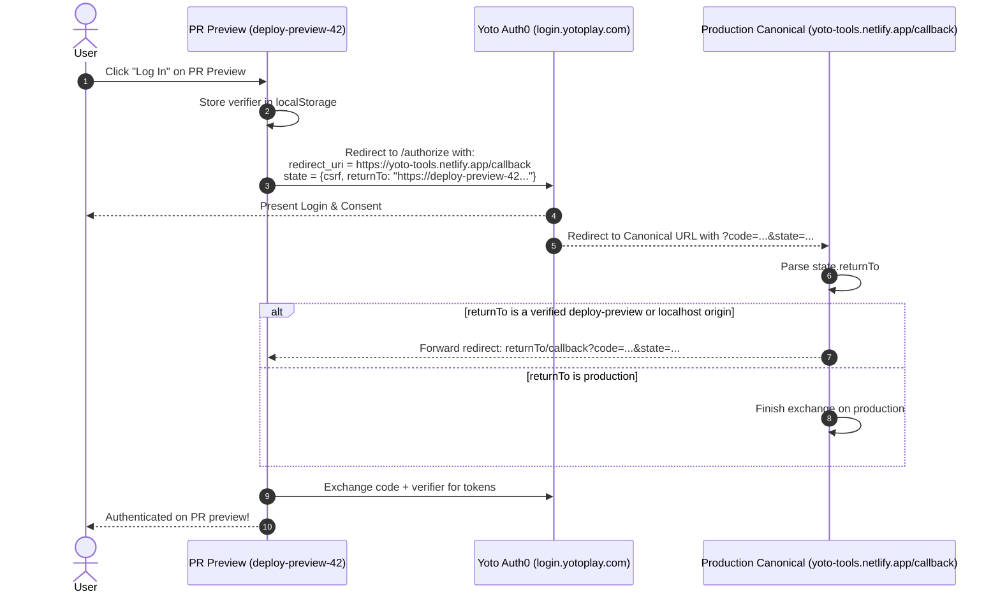

# RFC: OAuth Client Registration & Ephemeral PR Preview Redirect Strategy

- **Date:** 2026-09-17
- **Status:** Accepted
- **Author:** Antigravity Agent & Andrew Nitschke

---

## 1. Summary

This proposal defines how OAuth 2.0 authentication is configured across environments in `yoto-tools`. Specifically, it solves the challenge of dynamic, ephemeral Pull Request deploy preview URLs (e.g. `https://deploy-preview-12--yoto-tools.netlify.app/callback`) when registering allowed redirect URIs with Yoto's Auth0 identity service.

---

## 2. The PR Preview Redirect Challenge

Yoto's developer dashboard requires explicit whitelisting of exact callback URLs:
- **Production Callback URL:** `https://yoto-tools.netlify.app/callback`
- **Localhost Callback URL:** `http://localhost:5173/callback`
- **Dynamic PR Previews:** Netlify generates unique, ephemeral subdomains for every PR (e.g. `https://deploy-preview-42--yoto-tools.netlify.app`). Yoto's developer portal does not allow wildcard redirect URIs (`https://deploy-preview-*...`).

---

## 3. The Relay Redirect Solution: Canonical Callback Forwarding

To support fully functional OAuth login on ephemeral PR deploy previews without registering hundreds of individual URLs in the Yoto developer portal:



### A. State Payload Structure
The OAuth `state` parameter is passed as a signed or base64url-encoded JSON object:
```json
{
  "csrf": "random-secure-token",
  "returnTo": "https://deploy-preview-42--yoto-tools.netlify.app/callback"
}
```

### B. Canonical Callback Relay Security & Threat Analysis
When `https://yoto-tools.netlify.app/callback` receives the redirect:
1. It inspects `state.returnTo`.
2. **Origin Whitelist Verification:** It strictly validates that `returnTo` matches either:
   - `^https:\/\/deploy-preview-[0-9]+--yoto-tools\.netlify\.app\/callback$`
   - `^http:\/\/localhost:[0-9]+\/callback$`
   - Or its own production domain.
3. If valid, the canonical page immediately bounces the browser to the target preview URL with the `code` and `state` parameters intact.
4. The PR preview receives the code, retrieves its local `code_verifier`, and performs the token exchange.

#### Threat Model & Security Evaluation
- **Netlify Subdomain Namespace:** Netlify uses the double-hyphen (`--`) as an internal structural delimiter to separate context identifiers (`deploy-preview-123`) from registered site subdomains (`yoto-tools.netlify.app`). This prevents standard custom site registrations from colliding with deploy preview domains.
- **PKCE (RFC 7636) as the Definitive Security Backstop:**
  Even if an adversary were theoretically able to register a lookalike domain matching the regex, **authorization code interception does not lead to credential or token theft**. 
  - The OAuth authorization code is useless without the corresponding plaintext `code_verifier`.
  - The `code_verifier` is generated cryptographically in the user's browser session on the initiating PR preview and stored strictly in local memory (`sessionStorage`). It is never transmitted across the network during authorization or redirect steps.
  - When the attacker or rogue site attempts to exchange the stolen `code` at `https://login.yotoplay.com/oauth/token`, Auth0 requires the matching `code_verifier` that hashes to the initial `code_challenge`. The exchange will fail unconditionally.
- **Evaluation of Build-Time Cryptographic Signing:**
  We evaluated signing `returnTo` URLs with an asymmetric private key during GitHub Actions CI and verifying the signature with a bundled public key on production. While cryptographically sound, this approach introduces unnecessary build pipeline friction (secret management, signing scripts, key rotation) with no measurable security improvement over standard PKCE. Consequently, this complexity was rejected in favor of strict origin regex validation backed by native PKCE guarantees.

---

## 4. Client ID Configuration (Hybrid Model)

1. **Default Production Client ID:**
   - Bundled in repository configuration. Enables 1-click login for visitors on both production and PR previews without requiring manual registration.
2. **User-Overridable Client ID (BYO-App):**
   - A settings modal allows developers or advanced users to provide a custom Client ID, stored in `localStorage`.
   - If set, the app uses the custom Client ID and registers custom callback URLs directly.
