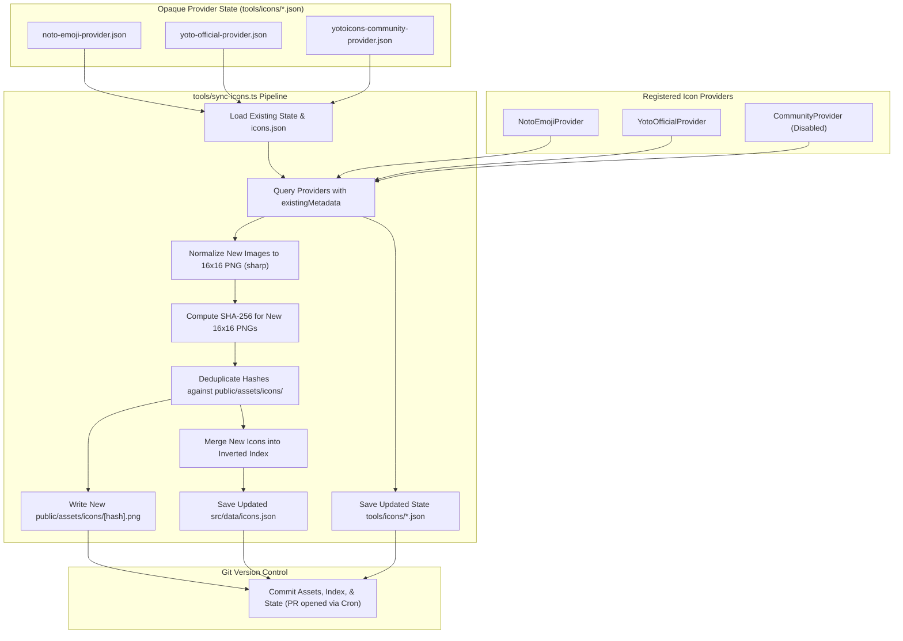

# RFC: Inverted Icon Indexing & Client-Side Search Engine

- **Date:** 2026-09-17
- **Status:** Accepted
- **Author:** Antigravity Agent & Andrew Nitschke

---

## 1. Summary

This proposal establishes the universal indexing strategy, extensible provider architecture, and client-side search engine used to look up 16×16 pixel icons across multiple icon providers (Google Noto Emoji, official Yoto icons, and community icons) in `yoto-tools`. 

To maximize CI/CD build speeds and ensure reliable offline development, **icon assets and indices are not fetched or scraped during ordinary application builds**. Instead:
1. All resized 16×16 PNG assets (`public/assets/icons/[hash].png`) and the generated index (`src/data/icons.json`) are **checked directly into the Git repository**.
2. Normal Vite builds take only seconds, as Vite simply copies `public/assets/` into `dist/assets/`.
3. An automated **GitHub Actions cron workflow** runs on a scheduled cadence (weekly or monthly) to execute `npm run sync:icons`, querying each registered icon provider for newly published icons and opening an automated Pull Request when changes are detected.

---

## 2. Extensible Incremental Icon Provider Architecture

The icon synchronization pipeline is built around an extensible, modular TypeScript interface located in `tools/icons/`. Rather than executing a slow, full re-crawl of every provider on every run, providers implement **incremental state tracking** using opaque provider metadata:

```typescript
// tools/icons/types.ts

export interface RawIconItem {
  id: string;                      // Unique ID within provider (e.g. 'noto_u1f431')
  provider: string;                // Provider key (e.g. 'noto-emoji', 'yoto', 'yotoicons')
  title: string;                   // Display title (e.g. 'Cat Face')
  tags: string[];                  // Associated keywords, categories, and aliases
  imageBytes: Uint8Array | Buffer; // Raw image bytes (SVG, PNG, etc.)
}

export interface IconsSyncResult<TMetadata = unknown> {
  icons: RawIconItem[];            // Newly added or modified icons
  metadata: TMetadata;             // Updated opaque state for this provider
}

export interface IconProvider<TMetadata = unknown> {
  /** Unique provider identifier */
  readonly name: string;

  /**
   * Fetch newly published or updated icons since the previous sync run.
   * @param existingMetadata Previous state loaded from tools/icons/{provider}.json (or undefined on initial run / rebuild).
   */
  fetchIcons(existingMetadata?: TMetadata): Promise<IconsSyncResult<TMetadata>>;
}
```

### Registered Providers & State Files (`tools/icons/`):
- **`tools/icons/noto-emoji-provider.ts` ([RFC 012](012-noto-emoji-icon-provider.md)):**
  - **State (`tools/icons/noto-emoji-provider.json`):** Stores dual commit hashes: `{ notoCommitHash: string, cldrCommitHash: string }`.
  - **Change Detection & Warning Mechanism:** Because Unicode emojis and CLDR keywords are updated infrequently and a full regeneration touches thousands of files, `npm run sync:icons` does **not** attempt automated incremental downloads for Noto. Instead, it queries the GitHub API for the latest commit hashes of both `googlefonts/noto-emoji` and `unicode-org/cldr`.
    - If the commit hashes match `existingMetadata`, it returns `{ icons: [], metadata: existingMetadata }` with zero network overhead.
    - If a hash mismatch is detected, it logs a prominent warning (formatted as a GitHub Actions workflow command: `::warning::Noto Emoji or CLDR upstream update detected...`) and outputs a Job Summary notice recommending a manual targeted rebuild (`npm run rebuild:icons -- --provider=noto-emoji`), leaving existing icons unchanged in automated cron runs.
- **`tools/icons/yoto-official-provider.ts` ([RFC 013](013-yoto-official-icon-provider.md)):**
  - **State (`tools/icons/yoto-official-provider.json`):** Stores `knownIconIds: string[]` (a set of all known Yoto `displayIconId`s).
  - **Incremental Logic:** Queries Yoto's `GET /media/displayIcons/user/yoto`. Filters out all icon IDs already present in `existingMetadata.knownIconIds`. Only downloads image assets for newly discovered IDs, returning them alongside the unioned list of IDs.
- **`tools/icons/yotoicons-community-provider.ts` ([RFC 014](014-yotoicons-community-integration.md)):** *(Proposed — Blocked on Maintainer Approval)*
  - **State (`tools/icons/yotoicons-community-provider.json`):** Stores `highestKnownId: number` (the largest icon ID processed so far).
  - **Incremental Logic:** Checks `https://yotoicons.com/icons?sort=new&page=1`. Terminates early the moment it encounters an icon ID $\le \text{highestKnownId}$, downloading only newly submitted icons and updating `highestKnownId`.

---

## 3. The `npm run sync:icons` Pipeline (`tools/sync-icons.ts`)

When `npm run sync:icons` is triggered (either manually by a developer or automatically via the GitHub Actions cron job):



### Execution Steps:
1. **Load Existing Index & State:** Reads current `src/data/icons.json` and provider state files (`tools/icons/*.json`).
2. **Query Providers (Incremental):** Invokes `provider.fetchIcons(existingMetadata)`. If a provider reports no changes, zero image downloads occur.
3. **Automated 16×16 Image Normalization (Infrastructure Level):**
   - For newly discovered icons, the sync engine normalizes **every image** to an exact **16×16 pixel PNG** using `sharp` (with letterboxing/padding on transparent canvas if non-square).
4. **Cryptographic SHA-256 Hashing & Deduplication:**
   - Computes `crypto.createHash('sha256').update(normalized16x16Bytes).digest('hex')`.
   - Writes new images to `public/assets/icons/${hashHex}.png` if not already present.
5. **Incremental Index Merge:** Merges new icon records and whole-word keyword tokens into `src/data/icons.json`.
6. **Save Provider State:** Writes updated metadata back to `tools/icons/{provider}.json`.

---

## 4. Rebuild Pipeline (`tools/rebuild-icons.ts`)

To regenerate the icon catalog from scratch—either globally or for a specific provider (e.g. when tweaking image downsampling algorithms, updating metadata tags, or removing a provider):
- `npm run rebuild:icons` (full rebuild of all providers)
- `npm run rebuild:icons -- --provider=noto-emoji` (targeted rebuild of a single provider)
- `npm run rebuild:icons -- --provider=yoto`

### Workflow & Orphan Cleanup Logic:
1. **Targeted Provider Eviction (if `--provider=<name>` specified):**
   - The script inspects `src/data/icons.json` and filters out all icons matching `icon.provider === targetProvider`.
   - Deletes only the targeted provider's state file: `tools/icons/${targetProvider}.json`.
   - Leaves all other providers and their cached state completely untouched.
2. **Provider Re-fetch:**
   - For the targeted provider(s), invokes `provider.fetchIcons(undefined)` with no metadata, forcing a clean fetch/generation from scratch.
3. **Re-Normalization & Image Ingestion:**
   - Normalizes newly fetched images to 16×16 PNG, hashes them, writes them to `public/assets/icons/`, and adds the fresh icon records to `src/data/icons.json`.
4. **Inverted Index Recompilation:**
   - Rebuilds the inverted token-to-index mapping from the updated full icons array to ensure all integer pointers remain compact and accurate.
5. **Orphan Asset Garbage Collection (Pruning `public/assets/icons/`):**
   - Collects the set of all active image hashes currently referenced across the updated `src/data/icons.json` (`activeHashes = new Set(icons.map(i => i.path))`).
   - Scans `public/assets/icons/` on disk. Any PNG file whose hash is not present in `activeHashes` is identified as an orphan and **deleted immediately**.
   - This guarantees that deleted or superseded icons never bloat the repository or disk over time.
6. **Save State & Output:**
   - Saves the updated provider state file (`tools/icons/${targetProvider}.json`) and writes the clean `src/data/icons.json`.

---

## 5. Scheduled GitHub Actions Cron Workflow (`.github/workflows/sync-icons.yml`)

To keep the icon library fresh without slowing down PR preview builds, a dedicated GitHub Actions workflow runs on a cron schedule:

```yaml
name: Sync Icon Providers

on:
  schedule:
    # Runs every Sunday at 02:00 UTC
    - cron: '0 2 * * 0'
  workflow_dispatch: # Allows manual trigger from GitHub UI

jobs:
  sync-icons:
    runs-on: ubuntu-latest
    steps:
      - name: Checkout repository
        uses: actions/checkout@v4

      - name: Setup Node.js
        uses: actions/setup-node@v4
        with:
          node-version: 22
          cache: 'npm'

      - name: Install dependencies
        run: npm ci

      - name: Run Icon Synchronization Pipeline
        run: npm run sync:icons

      - name: Create Pull Request if Updates Found
        uses: peter-evans/create-pull-request@v6
        with:
          commit-message: "chore(icons): update icon catalog and inverted index"
          title: "Automated Icon Sync: Update Icons and Search Index"
          body: |
            Automated weekly synchronization of registered icon providers (Google Noto Emoji and Official Yoto Icons).
            
            - Generated by `.github/workflows/sync-icons.yml`.
            - Please review the added or modified assets before merging.
          branch: "automated/sync-icons"
          delete-branch: true
```

---

## 6. Data Structure & Storage Format

The index is serialized as a single, highly compressed JSON file (`src/data/icons.json` in repository, copied to `dist/assets/icons-[hash].json` during build):

```json
{
  "version": 1,
  "icons": [
    {
      "id": "noto_u1f431",
      "provider": "noto-emoji",
      "title": "Cat Face",
      "path": "icons/a1b2c3d4e5f6.png",
      "tags": ["cat", "kitten", "pet", "feline", "animal"]
    },
    {
      "id": "yoto_cat_orange",
      "provider": "yoto",
      "title": "Orange Cat",
      "path": "icons/7f8e9d0c1b2a.png",
      "tags": ["cat", "orange", "pet", "animal"]
    }
  ],
  "index": {
    "cat": [0, 1],
    "kitten": [0],
    "pet": [0, 1],
    "feline": [0],
    "animal": [0, 1],
    "orange": [1]
  }
}
```

### Key Efficiency & Metadata Properties:
1. **Array Index References:** The token mapping (`"cat": [0, 1]`) stores integer indices pointing into the `icons` array rather than duplicating icon objects or IDs.
2. **Associated Tags on Icon Objects:** Each icon record includes a clean `tags: string[]` array listing all descriptive keywords and categories associated with that icon. This enables the UI to display helpful keyword tags, related search chips, or tooltip metadata when a user selects an icon in the picker.
3. **Pure Content-Addressable Path:** The `path` points directly to the image named by its content hash (`icons/[hash].png`). If multiple providers share the exact same 16×16 pixel art, they automatically share the same cached PNG asset.
4. **Compact Wire Size:** For ~30,000 icons, an integer-array inverted index with tag lists compresses to under 450 KB gzipped.
5. **Instant Lookup:** Keystrokes perform an $O(1)$ dictionary hash lookup to find matching icon indices.

---

## 7. Normalization & Tokenization Pipeline

During build generation, metadata fields (`title`, `tags`, `categories`, `description`) are normalized:
1. **Lowercasing & Diacritics Removal:** Convert to lower case and strip accents (e.g. `café` $\rightarrow$ `cafe`).
2. **Punctuation & Delimiter Splitting:** Split on hyphens, underscores, slashes, spaces, and punctuation into discrete whole-word tokens.
3. **Stop-Word Removal:** Discard uninformative generic tokens (`a`, `the`, `and`, `of`, `in`, `for`, `with`).
4. **Strict Whole-Word Token Indexing (No Arbitrary Substring Matching):**
   - We **strictly avoid arbitrary substring indexing** (e.g., matching `"car"` inside `"scary"`, `"card"`, or `"scarce"`). On platforms with tens of thousands of icons like `yotoicons.com`, arbitrary substring search produces massive amounts of irrelevant false positives that degrade search quality.
   - Only clean, whole-word tokens (and exact query token prefixes during client evaluation) are indexed and matched.

---

## 8. Client-Side Query Evaluation

When the user types into the icon search box:
1. **Multi-Word Queries (AND vs OR):**
   - By default, multiple query tokens perform an intersection (AND) to yield the most specific results.
   - If the intersection yields zero matches, the engine gracefully falls back to a union (OR) ranked by hit count.
2. **Provider Filtering:**
   - Filter predicates (e.g., `provider === 'yoto'`) are evaluated against candidate icon objects without rebuilding the search index.
3. **Relevance Ranking:**
   - Icons where the token matches the primary `title` are ranked higher than those matching only broad `category` or `description` tags.
   - For community icons, download/popularity counts break ranking ties.
