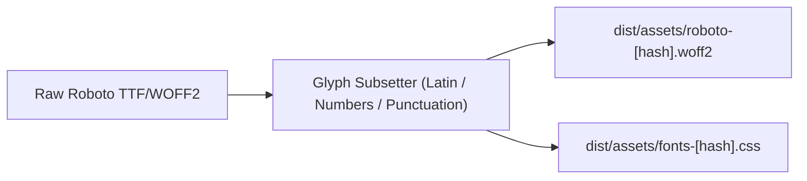

# RFC 017: Typography, Self-Hosted Roboto Font, and WOFF2 Bundling

- **Date:** 2026-09-18
- **Status:** Accepted
- **Author:** Antigravity Agent & Andrew Nitschke

---

## 1. Summary

This proposal establishes the typography standard for `yoto-tools`. To ensure high UI readability, complete offline functionality, zero external CDN requests, and strict CSP compliance, the application standardizes on the **Roboto** typeface, bundled locally as highly compressed **WOFF2** assets.

---

## 2. Selection: Roboto

**Roboto** is selected as the primary UI typeface for `yoto-tools`:
1. **Geometric & Mechanical Harmony:** Roboto’s dual nature—a largely geometric skeleton with friendly, open curves—matches the industrial design and friendly personality of Yoto hardware.
2. **Readability at Small Scales:** Excellent legibility at 12px–14px sizes, essential for dense track listings, chapter timestamps, and device telemetry badges.
3. **Apache 2.0 License:** Completely free and open-source, permitting local redistribution and subsetting without legal ambiguity.

---

## 3. Font Asset Bundling & Optimization

Rather than referencing Google Fonts CDNs via external `<link>` tags (which leaks user IPs and violates strict CSP policies):



### A. WOFF2 Compression & Subsetting
- Font assets are bundled as modern **WOFF2** files (brotli-compressed font format supported by 98%+ of browsers).
- Subsetting retains the Latin character set, standard punctuation, and tabular figures, reducing total font footprint to under 40 KB total.
- Weights bundled:
  - `Regular (400)`: Body text, track titles, descriptions.
  - `Medium (500)`: Button labels, active tabs, table headers.
  - `Bold (700)`: Primary headings, modal titles.

### B. Font Loading Stylesheet (`src/assets/fonts.css`)
```css
@font-face {
  font-family: 'Roboto';
  font-style: normal;
  font-weight: 400;
  font-display: swap;
  src: url('./roboto-regular.woff2') format('woff2');
}

@font-face {
  font-family: 'Roboto';
  font-style: normal;
  font-weight: 500;
  font-display: swap;
  src: url('./roboto-medium.woff2') format('woff2');
}

@font-face {
  font-family: 'Roboto';
  font-style: normal;
  font-weight: 700;
  font-display: swap;
  src: url('./roboto-bold.woff2') format('woff2');
}
```

### C. Design Tokens Integration (`src/widgets/theme.css.ts`)
```css
:root {
  --yt-font-family: 'Roboto', system-ui, -apple-system, BlinkMacSystemFont, "Segoe UI", sans-serif;
  --yt-font-family-mono: ui-monospace, SFMono-Regular, Menlo, Monaco, Consolas, monospace;
}
```

---

## 4. Performance & CSP Benefits

1. **Zero Layout Shifts (CLS = 0):** Local bundling and `font-display: swap` ensure text renders immediately without FOIT (Flash of Invisible Text).
2. **Offline Ready:** Because fonts are local static assets, the UI renders identically when offline or on unstable Wi-Fi.
3. **Strict CSP Harmony:** Fully complies with `font-src 'self'` and `style-src 'self'` in [RFC 016: Content Security Policy & Subresource Integrity](016-content-security-policy-and-sri.md).
