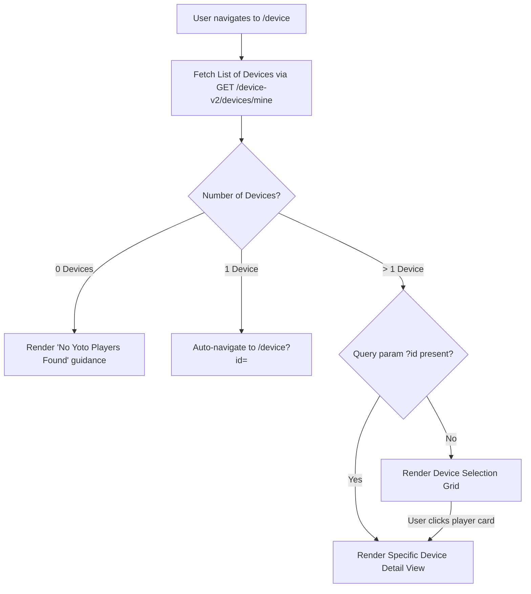

# RFC 018: Device Management, Status Monitoring, & Card Playback Remote Control

- **Date:** 2026-09-18
- **Status:** Accepted
- **Author:** Antigravity Agent & Andrew Nitschke

---

## 1. Summary

This proposal defines the user interface and architecture for managing Yoto player devices within `yoto-tools`. It specifies the `/device` route for viewing all registered Yoto players and `/device?id=<deviceId>` for inspecting real-time telemetry (battery percentage, charging status indicator, volume, firmware version, and currently playing card) and controlling playback (playing cards, pausing, and stopping audio) directly over AWS IoT MQTT WebSockets.

---

## 2. User Experience & Routing Design

The device interface is served under the `/device` route via `@lit-labs/router`:

### A. Automatic Device Selection & Navigation Heuristics
1. **Single-Device Accounts:** If the authenticated user has exactly **one** Yoto player registered to their account, navigating to `/device` automatically redirects / selects that device (`/device?id=<deviceId>`) without forcing the user to select from an unnecessary 1-item list.
2. **Multi-Device Accounts:** 
   - Navigating to `/device` displays a visual grid of all player cards showing the player's name, online/offline pill badge (`<yt-badge>`), and quick battery indicator.
   - Clicking any player card navigates to `/device?id=<deviceId>`, opening the detailed device dashboard.
3. **Direct URL Bookmarking:** Users can bookmark or directly load `/device?id=<deviceId>` to open the specific player directly.



---

## 3. Telemetry & Live Status Dashboard

When inspecting a specific player (`/device?id=<deviceId>`), the view renders real-time hardware telemetry:

### A. Key Metrics & Status Indicators:
1. **Connection Status:** `<yt-badge>` indicating `Online` (green) or `Offline` (neutral/grey).
2. **Battery & Power:**
   - **Battery Percentage:** 0% to 100% numeric readout with visual battery level indicator.
   - **Charging Indicator:** High-visibility lightning bolt badge (⚡) and "Charging" label when `charging === true`.
3. **Volume Slider / Readout:** Current device volume level ($0 - 100$ or $0 - 16$) with quick volume control buttons.
4. **Currently Playing Card / Track:**
   - Displays currently active card ID or resolved title.
   - Playback status: `Playing`, `Paused`, or `Idle`.
5. **Hardware & Firmware Metadata:**
   - Model / Product type (e.g. Yoto Player Gen 3, Yoto Mini).
   - Firmware version (`fwVersion`).
   - Nightlight status / color mode.

---

## 4. Remote Card Playback Control

Users can trigger card playback directly onto the active device:

1. **Card Picker Modal (`<yt-dialog>`):**
   - Clicking **"Play Card on Device"** opens a modal dialog listing the user's available Yoto cards and playlists.
   - Users can search or filter cards and click **"Play Now"**.
2. **Transport Controls:**
   - Interactive playback controls: **Play**, **Pause**, **Stop**, and Volume adjustments.
3. **WebSocket Communication (AWS IoT Core):**
   - Communication is conducted via MQTT over WebSockets (`wss://aqrphjqbp3u2z-ats.iot.eu-west-2.amazonaws.com/mqtt`) using the user's authenticated Yoto bearer token:
     ```typescript
     // Publish playback command
     const topic = `device/${deviceId}/command/card/start`;
     const payload = JSON.stringify({ uri: cardId });
     mqttClient.publish(topic, payload);
     ```
   - Control commands conform to the proven MQTT protocol implemented in `yotocli` (`pkg/yoto/mqtt_client.go`).

---

## 5. View Architecture & Component Integration

```
src/views/
└── device-view.ts        # Route handler for /device and /device?id=...
```

- **Widgets Used:**
  - `<yt-badge>`: Online/offline status, charging state, battery level.
  - `<yt-button>`: Transport controls (Play, Pause, Stop, Select Card).
  - `<yt-dialog>`: Card selection modal.
  - `<yt-progress-bar>`: Visual battery level meter.
- **Context Consumption:** Consumes `authContext` (user JWT token) and `devicesContext` (cached player collection) via `@lit/context`.
