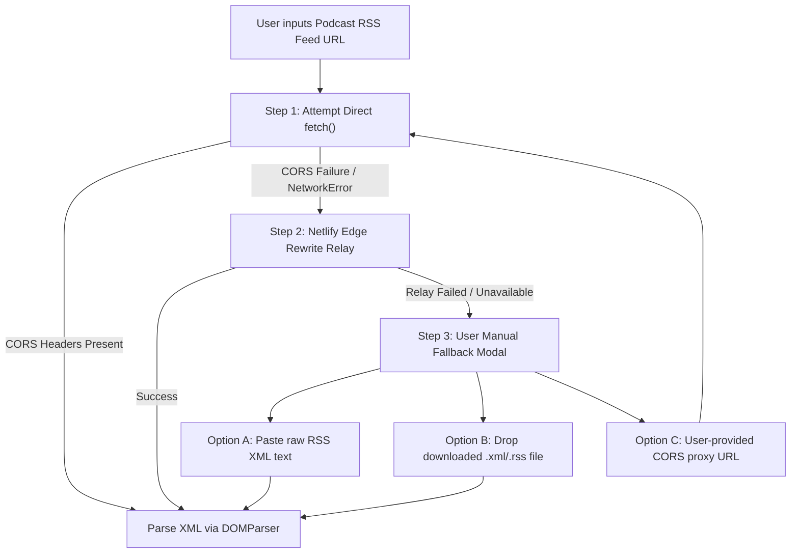

# RFC: CORS Proxy Strategy for External RSS Podcast Feeds

- **Date:** 2026-09-17
- **Status:** Accepted
- **Author:** Antigravity Agent & Andrew Nitschke

---

## 1. Summary

This proposal addresses the browser Same-Origin Policy (CORS) restrictions encountered when importing third-party podcast RSS XML feeds from arbitrary internet hosts. It defines the technical problem, why media files work while XML files fail, and establishes a multi-tiered proxy and fallback strategy that maintains zero backend infrastructure.

---

## 2. The Problem: The Asymmetric CORS Barrier

When a client-side web application attempts to ingest a podcast:

1. **Audio Enclosure Files (MP3/M4A) $\rightarrow$ Allow CORS:**
   - Podcast media hosts (e.g. PRX, Podtrac, Megaphone, Libsyn, CloudFront) almost universally emit `Access-Control-Allow-Origin: *` to enable web streaming in browsers and embedded players.
   - The browser can directly `fetch()` the audio binary as an `ArrayBuffer`, compute its SHA-256 hash using Web Crypto, and PUT it directly to Yoto's S3 upload endpoint.
2. **RSS Feed XML Endpoints $\rightarrow$ Blocked by CORS:**
   - RSS feed publishers (e.g., `feeds.wgbh.org`, NPR, Substack, custom WordPress sites) typically host XML files as static assets on S3, Apache, or Nginx **without** CORS headers.
   - Any direct browser request (`fetch("https://feeds.wgbh.org/2469/feed-rss.xml")`) fails immediately due to browser security checks:
     ```
     Access to fetch at 'https://feeds.wgbh.org/...' from origin 'https://yoto-tools.netlify.app'
     has been blocked by CORS policy: No 'Access-Control-Allow-Origin' header is present.
     ```

---

## 3. Proxy Architecture & Tiered Resolution Strategy

To provide a seamless user experience while adhering to our zero-server-maintenance principle, the application implements a multi-tiered resolution pipeline:



---

## 4. Implementation Details

### Tier 1: Direct Browser Fetch
Some modern podcast platforms (e.g., Spotify for Podcasters, Transistor) do return `Access-Control-Allow-Origin: *`. The client always attempts a direct `fetch()` first:
```typescript
try {
  const resp = await fetch(feedUrl, { signal: AbortSignal.timeout(4000) });
  if (resp.ok) return await resp.text();
} catch (err) {
  // CORS failure or timeout; proceed to Tier 2
}
```

### Tier 2: Edge Proxy Rewrite (`netlify.toml`)
For feeds blocked by CORS, requests are relayed via a same-origin path handled by Netlify edge rewrite rules:
```toml
# Netlify edge rewrite rule in netlify.toml
[[redirects]]
  from = "/api/rss-proxy/*"
  to = "https://relay.yoto-tools.workers.dev/:splat"
  status = 200
  force = true
```
- **Same-Origin Route:** The browser requests `https://yoto-tools.netlify.app/api/rss-proxy/?url=...`. Because the request is same-origin, the browser never blocks it.
- **Relay Mechanism:** The rewrite connects to a lightweight zero-maintenance edge relay (such as a free Cloudflare Worker with 100,000 req/day or CorsProxy.io with domain locking) that strips the CORS restrictions and adds `Access-Control-Allow-Origin: *`.
- **Zero Heavy Compute:** Because RSS XML files are tiny (30–80 KB), data transit costs and CPU time are negligible.

### Tier 3: Zero-Infrastructure Interactive Fallbacks
If edge proxying is unreachable or throttled:
1. **Raw XML Paste:** The user can open the feed in their browser, copy the XML, and paste it into a textarea.
2. **File Drop:** The user can download the `.xml` / `.rss` file and drag it into the app, read instantly via the browser `FileReader` API.
3. **Custom Proxy URL (BYOK):** Power users can supply their own proxy URL or API key in application settings.

---

## 5. Security & Privacy Guardrails

1. **Read-Only Text Transit:** The proxy is strictly used to fetch public RSS XML. No user credentials, authentication tokens, or private metadata are ever sent through the proxy.
2. **Strict MIME / Size Limits:** The proxy endpoint only accepts `GET` requests and rejects responses larger than 5 MB to prevent misuse.
3. **Audio Bypass:** Audio downloads **never** transit through the proxy; only the XML feed does. All multi-megabyte audio tracks stream directly from podcast CDNs to the browser and directly to Yoto S3.
