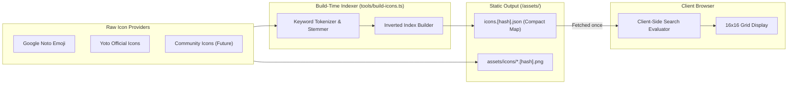

# RFC: Inverted Icon Indexing & Client-Side Search Engine

- **Date:** 2026-09-17
- **Status:** Accepted
- **Author:** Antigravity Agent & Andrew Nitschke

---

## 1. Summary

This proposal establishes the universal indexing strategy and client-side search engine used to look up 16×16 pixel icons across multiple icon providers (Google Noto Emoji, official Yoto icons, and community icons) in `yoto-tools`. It defines how search keywords are tokenized and mapped to icon IDs into an inverted index, stored in a compact JSON file, and evaluated in the browser with sub-millisecond query latency.

---

## 2. Inverted Index Architecture

Rather than executing linear string scans over thousands of icon objects on every keystroke, the build pipeline compiles an **inverted index** (mapping normalized tokens to lists of icon identifiers).



---

## 3. Data Structure & Storage Format

The index is serialized as a single, highly compressed JSON file (`icons.[hash].json`):

```json
{
  "version": 1,
  "icons": [
    {
      "id": "noto_u1f431",
      "provider": "noto-emoji",
      "title": "Cat Face",
      "path": "icons/noto/u1f431.a1b2c3d4.png"
    },
    {
      "id": "yoto_cat_orange",
      "provider": "yoto",
      "title": "Orange Cat",
      "path": "icons/yoto/yoto_cat.e5f6a7b8.png"
    }
  ],
  "index": {
    "cat": [0, 1],
    "kitten": [0],
    "pet": [0, 1],
    "feline": [0],
    "animal": [0, 1],
    "orange": [1]
  }
}
```

### Key Efficiency Properties:
1. **Array Index References:** The token mapping (`"cat": [0, 1]`) stores integer indices pointing into the `icons` array rather than duplicating icon objects or IDs.
2. **Compact Wire Size:** For ~30,000 icons, an integer-array inverted index compresses to under 400 KB gzipped.
3. **Instant Lookup:** Keystrokes perform an $O(1)$ dictionary hash lookup to find matching icon indices.

---

## 4. Normalization & Tokenization Pipeline

During build generation, metadata fields (`title`, `tags`, `categories`, `description`) are normalized:
1. **Lowercasing & Diacritics Removal:** Convert to lower case and strip accents (e.g. `café` $\rightarrow$ `cafe`).
2. **Punctuation Stripping:** Replace hyphens, underscores, slashes, and punctuation with whitespace.
3. **Stop-Word Removal:** Discard uninformative tokens (`a`, `the`, `and`, `of`, `in`, `for`).
4. **Sub-string & Prefix Indexing:** Index both whole words and common prefixes (3+ characters) to support typing partial queries.

---

## 5. Client-Side Query Evaluation

When the user types into the icon search box:
1. **Multi-Word Queries (AND vs OR):**
   - By default, multiple query tokens perform an intersection (AND) to yield the most specific results.
   - If the intersection yields zero matches, the engine gracefully falls back to a union (OR) ranked by hit count.
2. **Provider Filtering:**
   - Filter predicates (e.g., `provider === 'yoto'`) are evaluated against candidate icon objects without rebuilding the search index.
3. **Relevance Ranking:**
   - Icons where the token matches the primary `title` are ranked higher than those matching only broad `category` or `description` tags.
   - For community icons, download/popularity counts break ranking ties.
