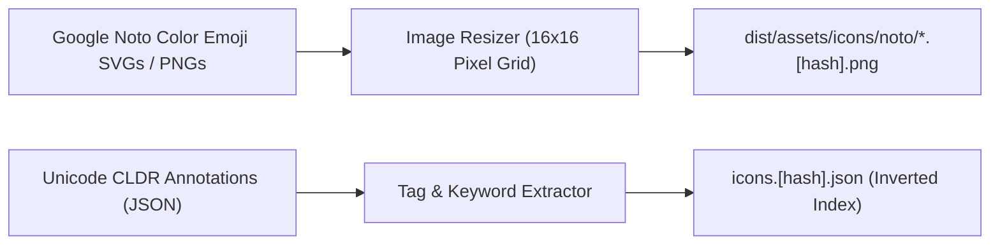

# RFC: Google Noto Emoji Icon Provider Integration

- **Date:** 2026-09-17
- **Status:** Accepted
- **Author:** Antigravity Agent & Andrew Nitschke

---

## 1. Summary

This proposal outlines the integration of Google Noto Emoji assets as a built-in icon provider for `yoto-tools`. Noto Emoji provides thousands of high-quality, legally unencumbered (Apache 2.0) 16×16 icons across animals, food, activities, nature, and objects.

---

## 2. Motivation & Licensing Advantages

1. **Permissive Apache 2.0 License:** Unlike scraped web assets, Google Noto Emoji is formally licensed under Apache 2.0. It can be freely bundled, transformed, and distributed without trademark or copyright complications.
2. **Standardized Unicode Tagging:** Emojis are officially classified with rich Unicode CLDR (Common Locale Data Repository) keywords, synonyms, and categories (e.g., 🐱 = `cat`, `pet`, `feline`, `meow`).
3. **Proven Compatibility:** `yotocli` already embeds Noto Emoji assets using a custom Go code generator (`internal/tools/gennoto/`). We can port this pipeline directly into TypeScript.

---

## 3. Asset Pipeline & Generation Workflow



### A. Resolution & Rendering
- Source emoji graphics are downscaled to crisp 16×16 PNG images optimized for Yoto's pixel matrix display.
- Nearest-neighbor and pixel-grid alignment algorithms ensure fine lines and high contrast remain legible on the physical player's display.

### B. Metadata Extraction & Indexing
- Unicode character names, aliases, and CLDR search keywords are parsed at build time.
- Extracted tags are fed into the universal inverted index defined in [RFC: Inverted Icon Indexing & Client-Side Search Engine](2026-09-17-inverted-icon-index-and-search.md).

### C. Build Command
- Managed via an offline build script:
  ```bash
  npm run generate:icons:noto
  ```
- Generates fingerprinted static PNG assets and populates the Noto partition of `icons.[hash].json`.
